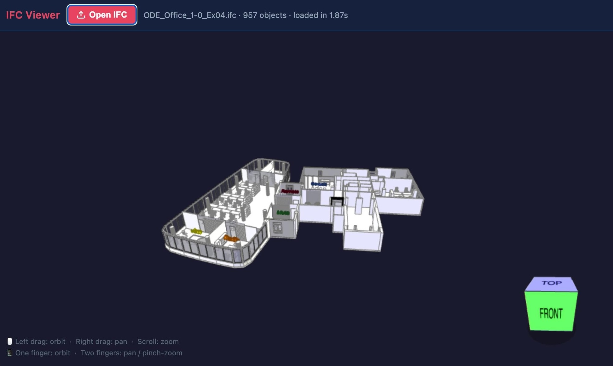

# BIMdata Viewer

A simple client-side IFC 3D viewer built with [xeokit](https://github.com/xeokit/xeokit-sdk) — open an `.ifc` file and explore it in the browser.



## Running locally

Install dependencies (only needed once):

```bash
npm install
```

Start the dev server:

```bash
npm run dev
```

Then open [http://localhost:5173](http://localhost:5173) in your browser.
